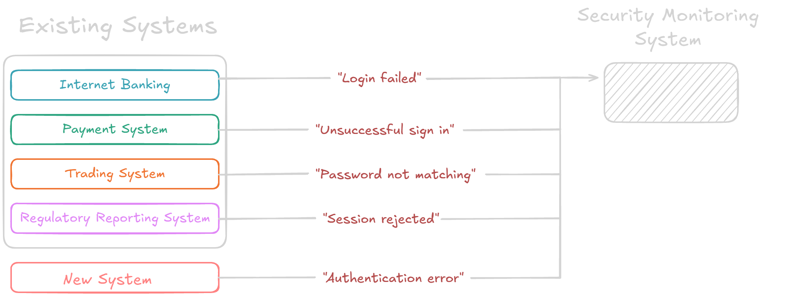

# 🔐 Login Event Detector

A Streamlit application that utilizes semantic similarity of pre-trained SecBERT for recognition of Login Event type Security logs

## Main problem
Modern enterprise environments generate massive volumes of authentication logs across diverse systems including internet banking, payment processing, trading platforms, and regulatory reporting systems. Each system produces logs in different formats with varying terminology for the same security events - a failed login might appear as "Login Failed", "Unsuccessful sign in", "Password not matching", "Session rejected", or "Authentication error" depending on the source system



### Current challenges facing security teams:
- Each system uses different log formats and terminology
- Security analysts spend hours manually correlating events across systems
- Time-consuming manual processes delay incident response

## Solution Overview
This repository provides an AI-powered log analysis system that uses BERT (Bidirectional Encoder Representations from Transformers) to intelligently classify authentication events across heterogeneous systems. The solution automatically:

Normalizes diverse log formats into standardized classifications
Understands context using semantic similarity rather than rigid pattern matching
Learns continuously from security analyst feedback through an integrated correction system
Provides explanations for each classification decision to support analyst workflow
Scales efficiently to handle enterprise-volume log processing

## Project structure
--- 
<pre>streamlit_progress/
├── data/
│   ├── created-logs/                # Output of giga_dataset_gen.py for SecBERT fine-tuning
│   ├── raw-logs/                    # Raw logs from LogHub (Linux, SSH)
│   ├── sample-logs/                 # 100 examples of login events (failed/success)
│   ├── train-logs/                  # Used during testing of previous BERT model iterations
│   └── log_preprocessing.ipynb
│
├── feedback/
│   ├── corrections.json
│   └── secbert_feedback.json        # (Empty or to be populated)
│
├── model/
│   ├── annotated_logs.txt
│   ├── NER/
│   │    ├── best_ner_model.pth
│   │    ├── vocabularies.pkl
│   │    └── test_tokenizer.ipynb 
│   │
│   └── model_utils/
│       ├── giga_dataset_gen.py
│       ├── model_utils.py
│       ├── config.json
│       └── bert_model.py
│
├── Streamlit_custom_utils/
│   ├── corrections_manager.py
│   ├── log_feedback.py
│   ├── ner_model.py                # To be added if I remember
│   └── splunk_configurator.py      # To be added if I remember
│
├── README.md
├── LICENSE
├── runtime.txt
├── requirements.txt                # Added tf-keras due to recent package update
└── streamlit_app.py</pre>
--- 


### Work in progress might delete later
Prostor kde se vypisuju - pak v AJ

Projekt je rozdělen do několika modulů, které si předávají výstupy v podobě .json souborů. První modul umožňuje prvnotní klasifikaci raw-log souborů dle obsahu logu (1 systém logu) na patřičný Login Event (Success/Failed). Po úspěšné klasifikaci se soubor ukládá do --Musím vymyslet-- a následně je připraven pro zpracování 2. modulem (Log parser). 2. modul obsahuje BiLSTM-CRF - NER model, který je naučen na přístupných log filech a taguje části logu na příslušný a existující atribut. Výstupem 2. modulu je opět .json soubor, který se ve spojení s 1. modulem využívá ve finálním modulu a to Splunk Configuártoru 🤷‍♂️


## 🌟 Features

- **Semantic Analysis**: Uses Sentence-BERT (all-MiniLM-L6-v2) model for semantic similarity
- **Text Normalization**: Automatically removes timestamps, IP addresses, and numbers
- **Interactive UI**: User-friendly interface with real-time analysis
- **Configurable Thresholds**: Adjust confidence levels for detection
- **Visual Analytics**: Distribution plots and threshold analysis
- **Export Options**: Download full results or high-confidence matches only

## 🚀 Getting Started

### Prerequisites

- Python 3.8 or higher
- pip

### Installation

1. Clone the repository:
```bash
git clone https://github.com/yourusername/failed-login-detector.git
cd failed-login-detector
