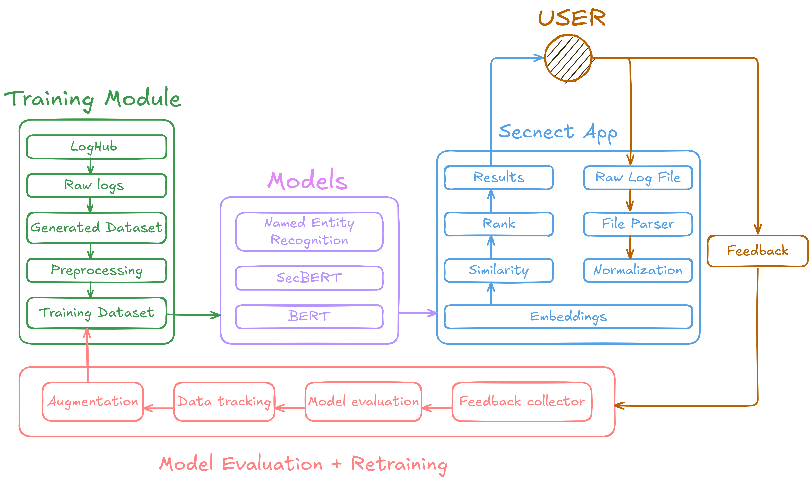

# 🔐 Log Intelligence Pipeline

A machine learning-powered pipeline for parsing, classifying, and extracting structured data from raw log files to streamline security event onboarding into Splunk.

## 📌 Project Highlights

- Accepts `.log`, `.csv`, and `.txt` files containing security logs
- Uses BERT for event similarity classification
- Extracts fields with NER and outputs structured `.json`
- Integrates with Splunk for security monitoring

## Main problem
Modern enterprise environments generate massive volumes of authentication logs across diverse systems including internet banking, payment processing, trading platforms, and regulatory reporting systems. Each system produces logs in different formats with varying terminology for the same security events - a failed login might appear as "Login Failed", "Unsuccessful sign in", "Password not matching", "Session rejected", or "Authentication error" depending on the source system

### Current challenges facing security teams:
- Each system uses different log formats and terminology
- Security analysts spend hours manually correlating events across systems
- Time-consuming manual processes delay incident response
- Huge back-log of applications that are not monitored -> security risk

## Solution Overview
This repository provides an AI-powered log analysis system that uses BERT (Bidirectional Encoder Representations from Transformers) to intelligently classify authentication events across heterogeneous systems. The solution semi-automatically:

Normalizes diverse log formats into standardized classifications
Understands context using semantic similarity rather than rigid pattern matching
Learns continuously from security analyst feedback through an integrated correction system
Provides explanations for each classification decision to support analyst workflow
Scales efficiently to handle enterprise-volume log processing

### Process

This workflow supports the ingestion and analysis of log data for security monitoring purposes. The process involves several stages:

1. **File Upload**  
   A security analyst uploads files in `.log`, `.csv`, or `.txt` format containing potential security-related events (e.g., login attempts).

2. **Similarity Analysis (BERT Model)**  
   The uploaded logs are analyzed using a BERT-based model to assess similarity to predefined event types.  
   > *Currently tested on login event data.*

3. **Classification and Correction**  
   After successful classification and optional manual corrections, a refined `.csv` file is generated.

4. **Named Entity Recognition (NER)**  
   The corrected `.csv` file is passed through an NER model to extract relevant features from the logs. This results in a structured `.json` file containing the extracted fields.

5. **Splunk Integration**  
   The final `.json` file is used to configure Splunk and onboard the parsed logs into the security monitoring application.

'''
Doporučení pro dokumentaci řešení
• Nevkládejte kompletní kód, ale odkaz do repa (git). Případně použijte pseudokód.
• Nejde o návod k používání nástroje, ale o dokument vysvětlující architekturu řešení a
popisující zvolený technologický stack (jaký a proč byl vybrán).
• Obsahuje zevrubný popis toku dat (data lineage), od vstupu na výstup (k uživateli), popis
dat včetně zhodnocení kvality, použité transformace, aplikaci algoritmů AI/ML
• Ukazuje a popisuje hlavní výstupy a frontend.
• Vysvětluje kompromisy v implementaci a dává doporučení pro další rozvoj.
• Dále, pokud je to relevantní, stručně popisuje postup pro produkční zavedení ve firmě. 
'''

## Key Components

### 🧠 Model Layer (/model/)
BERT-based classifier with configurable semantic prototypes
Dynamic preprocessing that adapts to different log formats
Confidence scoring with explainable predictions
JSON-configurable thresholds and classification parameters

### 🔧 Model Utilities (/model_utils/)
Large-scale synthetic data generator (20K+ realistic log entries)
Feedback integration system that learns from user corrections
Multi-model support (SentenceTransformers + SecBERT)
Enhanced similarity analysis with semantic, lexical, and string matching

### 🏷️ Named Entity Recognition (/ner/)
Custom NER model for extracting structured data from logs
BiLSTM-CRF architecture optimized for cybersecurity terminology
Entity extraction for timestamps, IPs, usernames, ports, and status indicators
Real-time inference with JSON-formatted output

## Project structure
<pre>streamlit_progress/
├── data/
│   ├── created-logs/                # Output of giga_dataset_gen.py for SecBERT fine-tuning
│   ├── raw-logs/                    # Raw logs from LogHub (Linux, SSH)
│   ├── sample-logs/                 # 100 examples of login events (failed/success)
│   ├── train-logs/                  # Used during testing of previous BERT model iterations
│   └── log_preprocessing.ipynb
│
├── feedback/          
│   └── corrections.json             # Used for evaluation and tracking training usage
│
├── model/
│   ├── annotated_logs.txt
│   ├── NER/
│   │    ├── best_ner_model.pth
│   │    ├── vocabularies.pkl       # vocab generated during training phase
│   │    └── test_tokenizer.ipynb   # 
│   │
│   └── model_utils/
│       ├── giga_dataset_gen.py
│       ├── model_utils.py
│       ├── config.json
│       └── bert_model.py
│
├── Streamlit_custom_utils/
│   ├── corrections_manager.py
│   ├── log_feedback.py
│   ├── ner_model.py                # To be added if I remember
│   └── splunk_configurator.py      # To be added if I remember
│
├── README.md
├── LICENSE
├── runtime.txt
├── requirements.txt                # Added tf-keras due to recent package update
└── streamlit_app.py</pre>
--- 

## 🧠 Our Thoughts and Conclusions
- In the first iterations, we found a pretrained **SecBERT** model for security text. However, it turned out to be ineffective for classifying or understanding the semantics of login events. For example, it struggled with events like `Login failed for user: xyz`. After this realization, we rolled back to the standard **BERT** model, which proved to be a much better option.
- For log parsing, we initially tested our field favorite: **Drain3**. Drain is a state-of-the-art, open-source log parser that performs well on large log files. However, when working with only snippets of logs, it becomes difficult to "decode" the discovered templates accurately, often requiring human intervention for adjustments. After further research and reviewing several studies, **NER models** appeared promising. We tested them on **LogHub** samples, and the results were very encouraging. The fact that **NVIDIA** developed its own "flexible log parser" in collaboration with **Splunk** indicates this approach may be a current field standard or even state-of-the-art. Still, it remains unclear how widely these tools are actually adopted in production.
- The development of **LLMs** and **chatbots** could further help solve this problem, given their ability to understand semantics and generate structured outputs using well-crafted prompts. However, a major concern with using models like those from **OpenAI** is the risk of hallucinations during prompting, which means extra caution is necessary. Another potential solution is to use **RAG** (Retrieval-Augmented Generation) to support these models with additional context from security documentation and vocabularies. Supplementing with curated sources can reduce hallucinations and improve consistency, especially for cybersecurity-specific events.

## 🌟 Room for Improvement
- Create a unified pipeline that takes `.log`, `.csv`, or `.txt` files as input and outputs the Splunk configuration — or develop this as a Splunk plugin/module to automate the process and save time.
- Leverage **NVIDIA Morpheus** parsers and other state-of-the-art tools for log analysis to ensure the highest quality parsing and feature extraction.
- Integrate a working database or temporary caching system to store user feedback logs. This would allow for ongoing model updates and improvements. For privacy, the logs should be deleted after use if they contain sensitive information — or consider an entirely different approach to feedback handling.
- Reconsider the implementation platform: **Streamlit** is currently a temporary solution. In the future, this tool could be integrated directly into Splunk as a plugin/module, or offered as an **AWS** service or something more aligned with enterprise infrastructure.
- Develop an automated monitoring pipeline to evaluate whether the **NER** model is correctly assigning tags, ensuring long-term performance and accuracy. 
